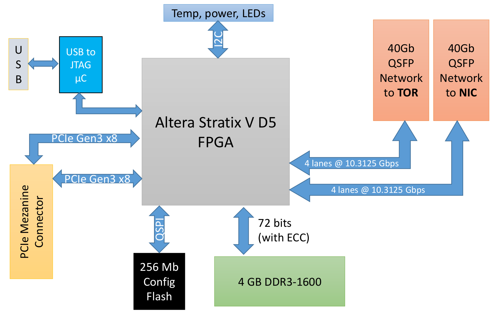

# storey-peak
Collected resources and getting started with Azure PCIe FPGA device

## Introduction

Getting started with production grade high-end FPGA devices is usually either extremely expensive (with official dev kits) or daunting (using refurbished hardware). This makes it prohibitive to start as a hobbyist.

There is a body of knowledge around the MSFT Azure Storey Peak boards which can be bought online for $80, and is an excellent all-round high-end FPGA board (PCIe, SDRAM, QSFP+, etc.) albeit from around 2015 or so.

In this repo, I collect the different sources available online and add some of my own code that makes this all work on Windows.

There is a blog to support this repo on getting started quickly [here](https://devops.lol/azure-fpga).

## Architecture and features

The main components of the board (note that in this version the 2 PCIe x8 links go to a single x16 PCIe slot connector):

## Main features

- Intel Stratix V GS (DSP-optimized), p/n 5SGSKF40I3LNAC (*see note 1)
- 2x QSFP 40G cages
- 9x Skhynix H5TC4G83BFR 8-bit 4Gb DDR3L, 72-bit bus (64 bit + ECC)
- PCIe Gen3 x16 (logically 2x bifurcated x8)

Find the complete bill of material [here](BOM.md)

## Online sources

- the central piece that got me started was the [blog series](https://j-marjanovic.io/stratix-v-accelerator-card-from-ebay.html) by [Jan Marjanovic](https://twitter.com/janmarjanovic), starting around the Open CloudServer (OCS) form factor 'Pikes peak' which is essentially the same - just not with SAMTEC but PCIe connector.
- PDF describing MSFT's [journey with FPGAs](https://indico.fnal.gov/event/22303/contributions/246438/attachments/157852/206736/Catapult_Putnam_Snowmass_2022_FPGA_Cloud__for_HPC.pdf). The board here is part of Catapult v2 (yes they go up to v3 and [further](https://github.com/tow3rs/catapult-v3-smartnic-re/issues/2)
- overview of the OCS part by [wirebond](https://github.com/wirebond/catapult_v2_pikes_peak)
- overview by [@occamlab](http://virtlab.occamlab.com/home/zapisnik/microsoft-catapult-v2)

## Included repos (submodules)

### Setting up Quartus for this board

- jtag-quartus-ft232h - JTAG library for FT232H on Quartus *Linux*
- jtag-quartus-ft232h-windows - JTAG library for FT323H on Quartus *Windows*

- sv_second_ip - how to enable 2nd PCIe hard ip on Quartus *Linux*
- sv_second_ip_windows - same for Quartus *Windows*

### Main project

- pp-sp-reference-design - the main project for getting started, and contains the qsf file for board support

### RE project

- otma-pin-re - pin configuration reverse engineering project based on factory FW
- catapult-pikes-peak - contains among others the factory firmware as extracted by @wirebond
- firmware - contains the factory firmware as extracted by me
