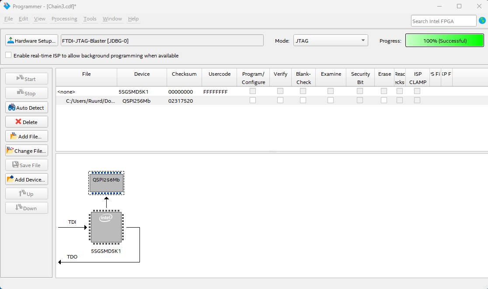
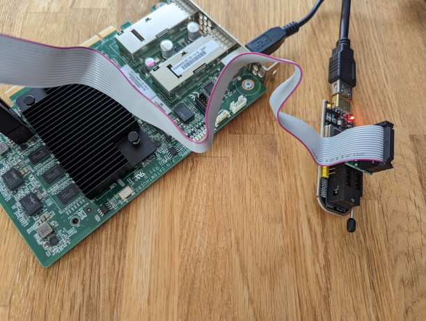

# Storey peak factory firmware

There are two ways to extract the firmware:

1. through Quartus Programmer
2. through direct connection of the ROM chip with a programmer using flashrom

## Method 1 - Quartus Programmer

When you open the JTAG programmer and connect a flash device, you can read the contents of the ROM (Quartus will program the FPGA with a default flashloader IP). Check examine, download the ROM (detected here as QSPI) and you'll be able to save it as a .jic file:



The output of this procedure is in the factory_fw.jic file. This file contains more than just the raw bytes in the ROM. We can extract the ROM contents by stripping the header.


## Method 2 - direct ROM chip readout

### Connecting to the ROM

This firmware was extracted with a CH341a mini programmer in combination with flashrom.

The Micron ROM is a SOIC-16 package. I used a clamp to connect to the package, and a SOIC-16->SOIC-8 adapter to connect this to the CH341a:



### Reading the firmware

The flashrom Linux utility was used to read the chip's contents:

```
ruurd@ruurd0fpga:~$ flashrom --programmer ch341a_spi
flashrom v1.2 on Linux 5.8.0-43-generic (x86_64)
flashrom is free software, get the source code at https://flashrom.org

Using clock_gettime for delay loops (clk_id: 1, resolution: 1ns).
Found Micron/Numonyx/ST flash chip "N25Q256..3E" (32768 kB, SPI) on ch341a_spi.
Found Micron flash chip "MT25QL256" (32768 kB, SPI) on ch341a_spi.
Multiple flash chip definitions match the detected chip(s): "N25Q256..3E", "MT25QL256"
Please specify which chip definition to use with the -c <chipname> option.
```

Flash rom auto-detects 2 possible chips here. We know it's a N25Q256..3E so let's continue with that one:

```
ruurd@ruurd0fpga:~$ flashrom --programmer ch341a_spi -c N25Q256..3E -r N25Q256_original.bin
flashrom v1.2 on Linux 5.8.0-43-generic (x86_64)
flashrom is free software, get the source code at https://flashrom.org

Using clock_gettime for delay loops (clk_id: 1, resolution: 1ns).
Found Micron/Numonyx/ST flash chip "N25Q256..3E" (32768 kB, SPI) on ch341a_spi.
===
This flash part has status UNTESTED for operations: PROBE READ ERASE WRITE
The test status of this chip may have been updated in the latest development
version of flashrom. If you are running the latest development version,
please email a report to flashrom@flashrom.org if any of the above operations
work correctly for you with this flash chip. Please include the flashrom log
file for all operations you tested (see the man page for details), and mention
which mainboard or programmer you tested in the subject line.
Thanks for your help!
Reading flash... done.
```

So big disclaimer from flashrom here but it works, and the output of this procedure is in the N25Q256A83E40.bin file.

Validating on a 2nd run the shasum is identical:

```
ruurd@ruurd0fpga:~$ sha256sum N25Q256_original.bin N25Q256_original_run2.bin
cd5f7f235a4821fd48a5da029291c69df5fe40be0b924f785380ecb278cf8274  N25Q256_original.bin
cd5f7f235a4821fd48a5da029291c69df5fe40be0b924f785380ecb278cf8274  N25Q256_original_run2.bin
```

## Differences between the methods and other firmware

TODO: 
- compare methods

There are non-trivial differences between the .jic produced here and in @wirebond's repo firmware (also here in /catapult_v2_pikes_peak). We'll have to dive deeper to understand those.